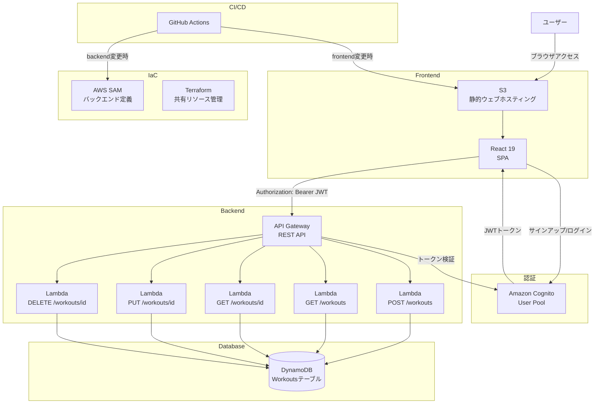
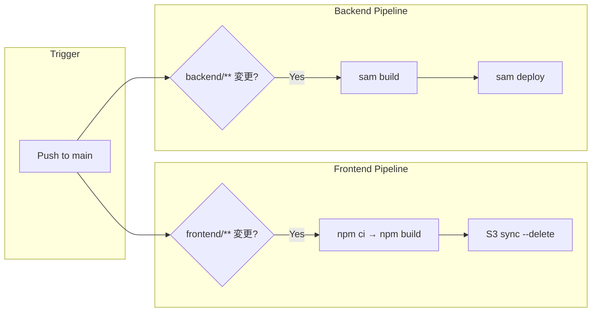

# Workout Management App

ワークアウト（筋トレ）記録を管理するWebアプリケーション。
AWSサーバーレスアーキテクチャを採用し、インフラのコード管理からCI/CDまで一貫して構築した個人開発プロジェクトです。

## アーキテクチャ



### 各AWSサービスの役割

| サービス | 役割 |
|---------|------|
| **S3** | Reactビルド成果物のホスティング（静的ウェブサイト） |
| **API Gateway** | REST APIエンドポイント。スロットリング（10burst/5rps）とCognito認証を設定 |
| **Lambda** | 各APIエンドポイントに対応する関数（Python 3.9）。1エンドポイント1関数の構成 |
| **DynamoDB** | ワークアウトデータの永続化。オンデマンドキャパシティで運用 |
| **Cognito** | ユーザー認証・認可。メールベースのサインアップとJWTトークン発行 |
| **SAM** | Lambda・API Gateway・DynamoDB・Cognitoのデプロイ管理 |
| **Terraform** | S3・DynamoDB・Cognitoなど共有リソースのコード管理 |

## 技術選定の理由

### なぜサーバーレスか

- **運用コストの最適化**: 個人開発では常時稼働するサーバーは不要。リクエスト課金のLambdaとオンデマンドDynamoDBで、使わない時のコストをほぼゼロに抑えられる
- **スケーラビリティ**: サーバー管理なしで自動スケール。EC2のキャパシティプランニングが不要
- **学習目的**: Java/Spring Bootの業務経験を活かしつつ、クラウドネイティブな設計パターンを実践的に習得するため

### なぜDynamoDBか

- **アクセスパターンが明確**: 「ユーザーごとのワークアウト一覧取得」が主要クエリであり、パーティションキー（userId）による効率的なアクセスが可能
- **RDBとの比較**: ワークアウトデータは1ユーザーに閉じており、テーブル間のJOINが不要。exercises配列をネストした形で1アイテムに格納できるDynamoDBの方がデータモデルとして自然
- **運用面**: オンデマンドキャパシティにより、RDSのようなインスタンス管理やコネクション管理が不要

### なぜPython（Lambda）か

- **AWS Lambdaとの親和性**: コールドスタートが比較的軽く、boto3（AWS SDK）が標準で利用可能
- **学習コストと実用性**: Pythonはサーバーレス関数の実装言語として広く採用されており、AWSの公式サンプルやドキュメントも豊富

### なぜReactか

- **エコシステムの成熟度**: Cognito連携ライブラリ（amazon-cognito-identity-js）が充実しており、認証フローの実装がスムーズ
- **SPAとの相性**: S3静的ホスティングとの組み合わせで、サーバーサイドレンダリング不要のシンプルな構成を実現

## DynamoDBテーブル設計

### テーブル定義

| テーブル名 | パーティションキー (PK) | ソートキー (SK) | キャパシティ |
|-----------|----------------------|----------------|------------|
| Workouts | `userId` (String) | `workoutId` (String) | PAY_PER_REQUEST |

### アイテム構造

```json
{
  "userId": "cognito-sub-xxxx",
  "workoutId": "2025-01-15T10:30:00_a1b2c3d4",
  "date": "2025-01-15",
  "exercises": [
    {
      "exerciseName": "ベンチプレス",
      "sets": [
        { "weight": 60, "reps": 10 },
        { "weight": 70, "reps": 8 }
      ]
    }
  ],
  "memo": "フォームを意識して実施"
}
```

### アクセスパターンと設計意図

| アクセスパターン | 操作 | キー条件 |
|---------------|------|---------|
| ユーザーの全ワークアウト取得 | Query | PK = userId, ScanIndexForward = false（新しい順） |
| 特定ワークアウト取得 | GetItem | PK = userId, SK = workoutId |
| ワークアウト作成 | PutItem | PK = userId, SK = タイムスタンプ_UUID |
| ワークアウト更新 | UpdateItem | PK = userId, SK = workoutId |
| ワークアウト削除 | DeleteItem | PK = userId, SK = workoutId |

### RDB経験者としてのNoSQL設計の工夫

- **正規化の放棄**: RDBであればexercisesテーブル・setsテーブルに分割するところを、DynamoDBでは1アイテムにネストして格納。JOINなしで1回のGetItemで全データを取得できる
- **ソートキーの設計**: `{ISO_timestamp}_{UUID先頭8文字}` の形式を採用。タイムスタンプにより時系列ソートが可能で、UUIDサフィックスで同一秒のワークアウトでも一意性を保証
- **シングルテーブルデザインは不採用**: 現時点ではエンティティがワークアウトのみのため、過度な設計を避けてシンプルなテーブル構成とした。エンティティが増えた場合に検討する方針

## CI/CD パイプライン

GitHub Actionsによる自動デプロイを構築。mainブランチへのpush時にパスベースで対象ワークフローが発動する。



| 項目 | フロントエンド | バックエンド |
|------|-------------|------------|
| **トリガー** | `frontend/**` の変更 | `backend/**` の変更 |
| **ビルド** | `npm ci` → `npm run build` | `sam build` |
| **デプロイ** | `aws s3 sync` | `sam deploy` |
| **認証方式** | OIDC (AssumeRoleWithWebIdentity) | OIDC (AssumeRoleWithWebIdentity) |
| **デプロイ先** | S3バケット | Lambda / API Gateway (CloudFormation) |

### セキュリティ面の工夫

- **OIDC認証**: 長期的なAWSアクセスキーをGitHub Secretsに保存せず、OpenID ConnectでAWSとの信頼関係を構築
- **最小権限**: フロントエンド用とバックエンド用でIAMロールを分離し、それぞれ必要な権限のみを付与
- **CodeRabbit**: PRに対するAIコードレビューを導入し、品質とセキュリティのチェックを自動化

## 工夫した点・技術的チャレンジ

### Cognito認証の実装

- フロントエンドで `amazon-cognito-identity-js` を使用し、サインアップ → メール確認 → ログインの完全な認証フローを実装
- API GatewayのCognito Authorizerにより、バックエンド側でトークン検証ロジックを書く必要がない構成を実現
- Lambda関数ではCognitoの `sub` クレームからuserIdを取得し、データのユーザー分離を保証

### API設計

- RESTfulな設計（`/workouts` リソースに対するCRUD操作）
- 1エンドポイント1Lambda関数の構成で、関数ごとの独立デプロイと最小権限（ReadPolicyとCrudPolicyの使い分け）を実現
- すべてのレスポンスにCORSヘッダーを含め、S3ホスティングとのクロスオリジン通信に対応

### フロントエンドとバックエンドの責務分離

- フロントエンド: UI表示・ユーザー入力・認証トークン管理に責務を限定。API通信は `src/api/` に集約
- バックエンド: ビジネスロジックとデータアクセスに集中。認証検証はAPI Gateway層に委譲
- インフラ定義: SAM（バックエンド固有リソース）とTerraform（共有リソース）で役割を分担

## 今後の改善予定

- CloudFront導入によるCDN配信とHTTPS対応
- ワークアウト統計ダッシュボード（種目別ボリューム推移グラフなど）の追加
- エクササイズマスタの導入（よく使う種目の選択式入力）
- バックエンドのユニットテスト・統合テスト拡充
- フロントエンドのレスポンシブデザイン改善
- Terraform管理範囲の拡大（API Gateway、Lambda関数もTerraformで管理）
- エラーハンドリングの強化（フロントエンドでのユーザーフレンドリーなエラー表示）

---

## セットアップ手順

### 前提条件

- Node.js 20+
- Python 3.9+
- AWS CLI設定済み
- AWS SAM CLI
- Terraform

### フロントエンド

```bash
cd frontend
cp .env.example .env  # 環境変数を設定
npm ci
npm start             # http://localhost:3000
```

`.env` に以下を設定:
```text
REACT_APP_API_URL=<API GatewayエンドポイントURL>
REACT_APP_USER_POOL_ID=<Cognito User Pool ID>
REACT_APP_CLIENT_ID=<Cognito Client ID>
```

### バックエンド

```bash
cd backend/workout-api
sam build --use-container
sam local start-api    # ローカルAPI起動
sam deploy --guided    # AWSへデプロイ
```

### Terraform

```bash
cd terraform
terraform init
terraform plan
terraform apply
```

## 技術スタック

| カテゴリ | 技術 | バージョン |
|---------|------|----------|
| フロントエンド | React | 19.2.3 |
| 認証SDK | amazon-cognito-identity-js | 6.3.16 |
| バックエンドランタイム | Python | 3.9 |
| IaC (バックエンド) | AWS SAM | - |
| IaC (インフラ) | Terraform | AWS Provider ~> 5.0 |
| CI/CD | GitHub Actions | - |
| コードレビュー | CodeRabbit | - |

## Terraform（インフラ基盤管理）

DynamoDB、S3、CognitoなどのインフラリソースはTerraformで管理。

### 管理対象リソース
- **DynamoDB**: Workoutsテーブル
- **S3**: フロントエンドホスティング用バケット
- **Cognito**: User Pool & Client
- **S3**: Terraform state保存用バケット（暗号化・バージョニング有効）

### State管理
- S3バックエンド使用
- バケット名: `workout-app-terraform-state-saitoh`
- 暗号化・バージョニング有効

### ハイブリッド構成
```text
Terraform（インフラ基盤）:
├─ DynamoDB
├─ S3
└─ Cognito

SAM（アプリケーション層）:
├─ Lambda関数
└─ API Gateway
```

## プロジェクト構成

```text
workout-app/
├── .github/workflows/
│   ├── deploy-frontend.yml    # フロントエンド自動デプロイ
│   └── deploy-backend.yml     # バックエンド自動デプロイ
├── frontend/
│   ├── src/
│   │   ├── api/
│   │   │   ├── cognito.js     # Cognito認証（サインアップ/ログイン/トークン取得）
│   │   │   └── workouts.js    # API通信（CRUD操作）
│   │   ├── components/
│   │   │   ├── Auth.jsx       # 認証UI（ログイン/サインアップ/確認）
│   │   │   ├── WorkoutForm.jsx # ワークアウト入力フォーム
│   │   │   └── WorkoutList.jsx # ワークアウト一覧表示
│   │   └── App.jsx            # メインコンポーネント
│   └── .env.example
├── backend/workout-api/
│   ├── template.yaml          # SAMテンプレート（API Gateway, Lambda, DynamoDB, Cognito）
│   └── src/
│       ├── create_workout/    # POST /workouts
│       ├── list_workouts/     # GET /workouts
│       ├── get_workout/       # GET /workouts/{id}
│       ├── update_workout/    # PUT /workouts/{id}
│       └── delete_workout/    # DELETE /workouts/{id}
├── terraform/
│   ├── main.tf               # S3, DynamoDB, Cognito, Terraformステートバケット
│   ├── variables.tf           # 変数定義
│   └── output.tf             # 出力値定義
└── CLAUDE.md
```
